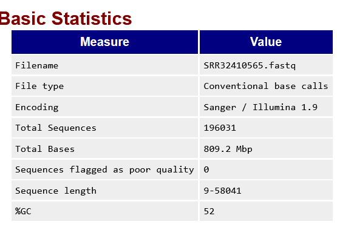
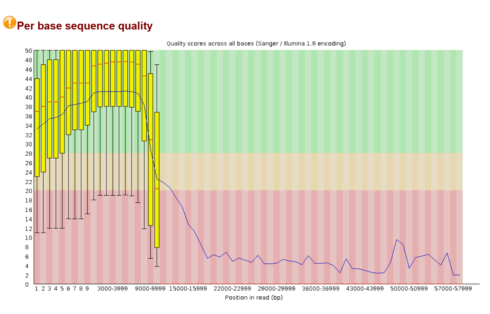
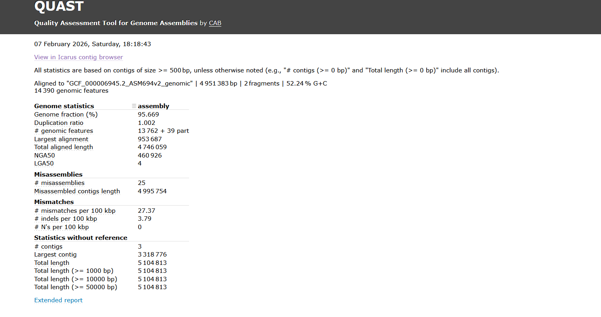
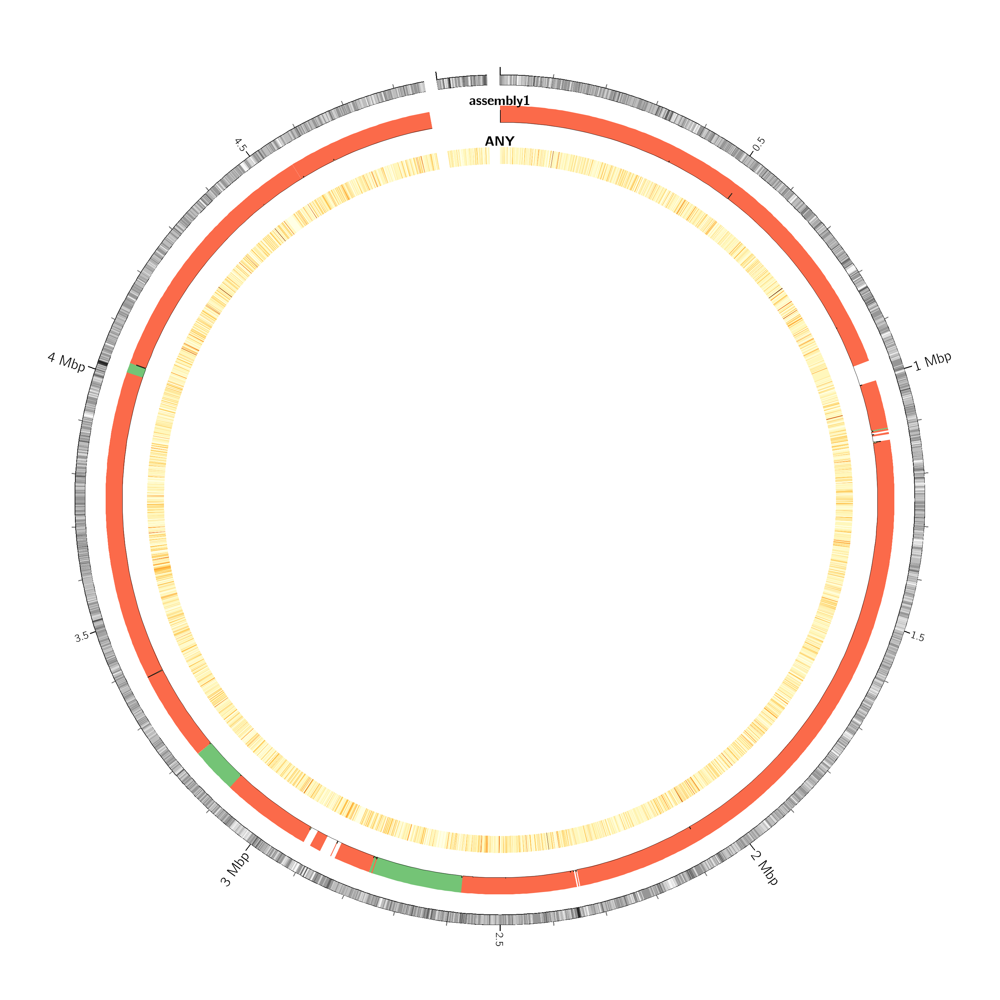
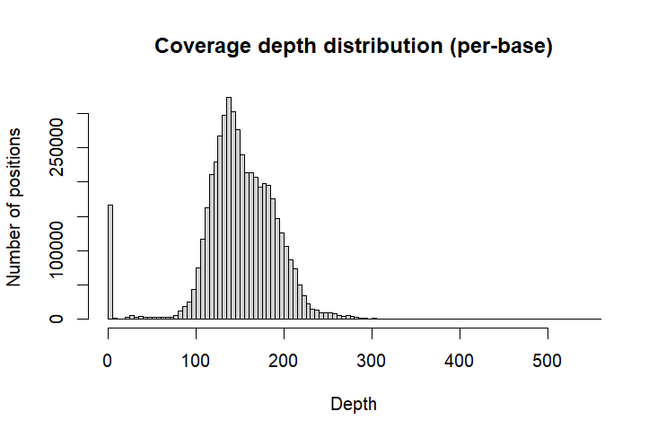
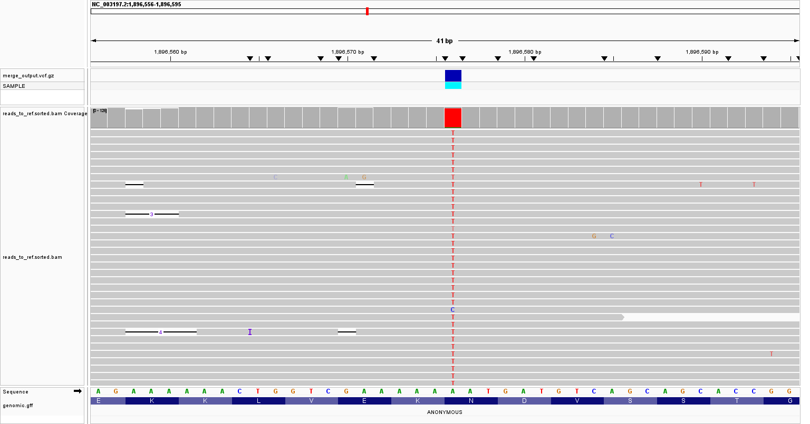

**ASSIGNMENT 1**

# Bacterial Genome Assembly and Comparison

**ASSIGNMENT 1**

**Introduction**  
The objective of this project is to make use of Oxford Nanopore Technologies (ONT) long reads (R10 chemistry) to assemble a \*Salmonella enterica\* genome and identify and visualize variants relative to a public reference genome from the National Center for Biotechnology Information (NCBI) database. Genomic analysis building on a foundational reference genome for *S. enterica* can help reveal genome-level differences that are central to interpreting potential impacts on virulence, transmission, and antimicrobial resistance (McClelland et al., 2001).

The goal of genome assembly is described as producing complete, accurate sequences with minimal fragmentation: the “one chromosome, one contig,” ideal (Koren & Phillippy, 2015).  Benchmarks on prokaryotic long-read data consistently find that there are several top performing assembly tools across different metrics, such as Flye (Kolmogorov et al., 2019). However, no single assembler performs perfectly on every metric (Wick & Holt, 2021). 

Comparing genetic material collected from a sample of an organism to a reference genome of the same organism serves as a way to identify variation. The challenge in this lies in quantifying variants as being due to biological differences versus errant differences. Raw reads are preferred when mapping against the reference genome, as opposed to the assembly, since it offers a more direct comparison when variant calling (Wick et al., 2025). The variable performance of assemblers also means that mapping assembled genomes to the reference could lead to errant calls being mistaken for variants due to missassembly or downstream processing errors which may be mitigated when the genome assembly is of perfect quality (Rojas-Miranda et al., 2025).

In this workflow, ONT reads are aligned to the reference genome using minimap2 (Li, 2018), and alignments are processed with samtools to produce a sorted, indexed BAM suitable for variant calling and visualization. Variants are called using Clair3 (Zheng et al., 2022), a deep learning–based method that has been shown to outperform traditional tools (Hall et al., 2024). Finally, results are visualized in IGV (Thorvaldsdottir et al., 2012\) to perform manual inspection to distinguish well-supported variants from erroneous artifacts.

**Methods:**

The overall workflow:

***Read QC → Assembly → Assembly QC***  

***Read alignment → Variant calling to Reference → Visualization**.*

A detailed description of the code and tools used (with versions recorded) and their output is present in the [pipeline.md](http://pipeline.md) file present in this repository.

---

## **Results:**

On performing quality control on the raw reads through the FastQC, there were 196,031 total reads. The read length range was 9–58,041 bp, with an overall strong early/mid-read quality (mean \~41 from \~10–8,000 bp bins). There was a clear tail-off in quality for the longest reads (mean drops to \~29 at 9–10 kb; \~22 at 10–11 kb; and \~2–7 in many 20–58 kb bins). The raw reads passed per-sequence quality scores (Figures 1 and 2\)

**Figure 1\. FastQC summary for ONT reads.**  
 *Caption:* Per-base quality and read length distribution for SRR32410565 (ONT R10).

**Figure 2\. FastQC Quality score plot for ONT reads.**  
 *Caption:* Per-base quality and read length distribution for SRR32410565 (ONT R10).

### **Assembly QC (QUAST)**

**Flye output:** `03_assembly/flye/assembly.fasta`

The results of QUAST analysis on the Flye generated assembly are included in Figure 3\. A Circos(version 0.69) plot was generated as well (Figure 4\) with the following legend: 

* The outer circle represents the reference sequence with GC (%) heatmap \[from 27% (white) to 69% (black)\].  
* Assembly tracks: assembly1 \- assembly –Assembly tracks are combined with mismatches visualization: higher columns indicate larger mismatch rate.  
* User-provided genes. A darker color indicates higher density of genes.

**Figure 3\. QUAST report summary for Flye assembly vs NCBI reference.**  
 *Caption:* Contiguity and reference-based accuracy metrics for Flye assembly compared to GCF\_000006945.2.

**Figure 4\. QUAST circos plot**  
*Caption:* Visualization of assembly-to-reference alignment and structural consistency.

### **Alignment metrics (minimap2 and samtools)**

Mapping quality and depth were summarized with `samtools coverage`: NC\_003197.2 had 97.80% breadth of coverage with mean depth 150.9× (mean MAPQ 59.5), while NC\_003277.2 had 43.10% breadth with mean depth 81.7× (mean MAPQ 44.7), where MAPQ reports the mapping qualities for the mapped reads, ignoring the duplicates, supplementary, secondary and failing quality reads (Danacek , 2025). The coverage depth distribution was plotted in R (Figure 5).

**Figure 5: Coverage histogram or summary plot.**  
 *Caption:* Coverage distribution across the reference genome from ONT read mapping.

### **Variant calling output (Clair3)**

**Primary outputs were:**

* VCF: `06_variant/clair3/merge_output.vcf.gz` (and the same file in`.tbi` format).  
* Summaries: `06_variant/clair3/`run clair3

Variant counts were obtained (using bcftools version 1.23), with an observed **10022** total variants, **8954** SNPs and **1092** Indels. **9618** variants were reported to have passed Clair3’s filtering criteria.

**Figure 6\. IGV screenshot of a representative high-confidence variant on the treA gene.**

*Caption*: Read pileup supporting a variant call showing consistent allele evidence across reads and strand representation.

---

**Discussion:**

The Flye assembly produced indicated relatively high contiguity for a bacterial genome with a small number of large contigs rather than many fragmented contigs. In the reference-guided QUAST evaluation against GCF\_000006945.2 (NC\_003197.2), results are suggestive that most of the reference is represented with minimal large-scale redundancy. However, the reported misassemblies and elevated small-error rates imply that while the assembly is broadly consistent with the reference structure, there are likely local structural inconsistencies and base-level errors that could inflate apparent differences if the assembly were used directly for small-variant interpretation. This validates the decision to rely on raw read mapping in downstream variant calling for this project rather than assembly-to-reference comparisons.

For the Salmonella Typhimurium LT2 reference (GCF\_000006945.2), **NC\_003197.2 is the main chromosome** and **NC\_003277.2** is the pSLT plasmid.

In variant calling the strongest candidates for true biological differences are positions where coverage is high and relatively uniform through the site, the same alternate base is present in most reads, and the surrounding alignments are otherwise clean.

In the region **NC\_003197.2:1,896,556-1,896,595**, for instance, a variant falls was found to fall within **treA (locus\_tag STM1796)**, encoding a periplasmic trehalase enzyme. The IGV pileup displayed reads largely agreeing at the same position rather than a scattered pattern which supports a confident call at this site (Fig. 6). Based on the codon change annotated (**AAT → TAT**), the mutation is predicted to be a **missense substitution (Asn → Tyr)**. Functionally, *treA* is involved in the utilization of a kind of sugar named trehalose (Repoila & Gutierrez, 1991). A mutation here could potentially alter enzyme activity or substrate interaction. 

**Limitations and future directions:**  
The usage of a single Flye assembler does not offer the whole picture when it comes to variant calling and investigation of genetic content, but offers an overall view of variation. Future analysis could be improved upon by using perfect assemblies, as this has been observed to increase accuracy in variant calling (Wick et al., 2025). This could be facilitated through  the use of consensus genome assembler tools, such as Autocycler (Wick et al., 2025\) that combine multiple input assemblies to produce a high-quality consensus. Additional rounds of polishing, when a single assembly is used, could also increase confidence in results. A practical next step for improved consensus accuracy would be to apply an ONT-focused polishing stage (for eg. Medaka or Racon) prior to downstream analyses, then re-check whether candidate variants persist.

 **References** 

* Andrews, S. (2010). *FastQC a quality control tool for high throughput sequence data*. Babraham.ac.uk. [https://www.bioinformatics.babraham.ac.uk/projects/fastqc/](https://www.bioinformatics.babraham.ac.uk/projects/fastqc/)  
* Danacek , P. (2025, December 16). *samtools-stats(1) manual page*. [https://www.htslib.org/doc/samtools-stats.html](https://www.htslib.org/doc/samtools-stats.html)  
* Hall, M. B., Wick, R. R., Judd, L. M., Nguyen, A. N., Steinig, E. J., Xie, O., Davies, M., Seemann, T., Stinear, T. P., & Coin, L. (2024). Benchmarking reveals superiority of deep learning variant callers on bacterial nanopore sequence data. *ELife*, 13\. [https://doi.org/10.7554/elife.98300](https://doi.org/10.7554/elife.98300)  
* Kolmogorov, M., Yuan, J., Lin, Y., & Pevzner, P. A. (2019). Assembly of long, error-prone reads using repeat graphs. *Nature Biotechnology*, 37(5), 540–546. [https://doi.org/10.1038/s41587-019-0072-8](https://doi.org/10.1038/s41587-019-0072-8)  
* Koren, S., & Phillippy, A. M. (2015). One chromosome, one contig: complete microbial genomes from long-read sequencing and assembly. *Current Opinion in Microbiology*, 23, 110–120. [https://doi.org/10.1016/j.mib.2014.11.014](https://doi.org/10.1016/j.mib.2014.11.014)  
* Lee, J. Y., Kong, M., Oh, J., Lim, J., Chung, S. H., Kim, J.-M., Kim, J.-S., Kim, K.-H., Yoo, J.-C., & Kwak, W. (2021). Comparative evaluation of Nanopore polishing tools for microbial genome assembly and polishing strategies for downstream analysis. *Scientific Reports*, 11(1). [https://doi.org/10.1038/s41598-021-00178-w](https://doi.org/10.1038/s41598-021-00178-w)  
* Li, H. (2018). Minimap2: pairwise alignment for nucleotide sequences. *Bioinformatics*, 34(18), 3094–3100. [https://doi.org/10.1093/bioinformatics/bty191](https://doi.org/10.1093/bioinformatics/bty191)  
* McClelland, M., Sanderson, K. E., Spieth, J., Clifton, S. W., Latreille, P., Courtney, L., Porwollik, S., Ali, J., Dante, M., Du, F., Hou, S., Layman, D., Leonard, S., Nguyen, C., Scott, K., Holmes, A., Grewal, N., Mulvaney, E., Ryan, E., & Sun, H. (2001). Complete genome sequence of *Salmonella enterica* serovar Typhimurium LT2. *Nature*, 413(6858), 852–856. [https://doi.org/10.1038/35101614](https://doi.org/10.1038/35101614)  
* nanoporetech/medaka. (2021, April 15). *GitHub repository*. [https://github.com/nanoporetech/medaka](https://github.com/nanoporetech/medaka)  
* Repoila, F., & Gutierrez, C. (1991). Osmotic induction of the periplasmic trehalase in *Escherichia coli* K12: characterization of the *treA* gene promoter. *Molecular Microbiology*, 5(3), 747–755. [https://doi.org/10.1111/j.1365-2958.1991.tb00745.x](https://doi.org/10.1111/j.1365-2958.1991.tb00745.x)  
* Rojas-Miranda, H., Madrigal-Ly, V., & Molina-Mora, J. A. (2025). Benchmarking genome assemblers for four bacterial models based on contiguity, correctness, and completeness. *Scientific Reports*, 15(1). [https://doi.org/10.1038/s41598-025-26847-8](https://doi.org/10.1038/s41598-025-26847-8)  
* Thorvaldsdottir, H., Robinson, J. T., & Mesirov, J. P. (2012). Integrative Genomics Viewer (IGV): high-performance genomics data visualization and exploration. *Briefings in Bioinformatics*, 14(2), 178–192. [https://doi.org/10.1093/bib/bbs017](https://doi.org/10.1093/bib/bbs017)  
* Wick, R. R., & Holt, K. E. (2021). Benchmarking of long-read assemblers for prokaryote whole genome sequencing. *F1000Research*, 8, 2138\. [https://doi.org/10.12688/f1000research.21782.4](https://doi.org/10.12688/f1000research.21782.4)  
* Wick, R. R., Howden, B. P., & Stinear, T. P. (2025). Autocycler: long-read consensus assembly for bacterial genomes. *Bioinformatics*, 41(9). [https://doi.org/10.1101/2025.05.12.653612](https://doi.org/10.1101/2025.05.12.653612)  
* Wick, R. R., Judd, L. M., & Holt, K. E. (2023). Assembling the perfect bacterial genome using Oxford Nanopore and Illumina sequencing. *PLOS Computational Biology*, 19(3), e1010905. [https://doi.org/10.1371/journal.pcbi.1010905](https://doi.org/10.1371/journal.pcbi.1010905)  
* Wick, R. R., Judd, L. M., Stinear, T. P., & Monk, I. R. (2025). Are reads required? High-precision variant calling from bacterial genome assemblies. *Access Microbiology*, 7(5). [https://doi.org/10.1099/acmi.0.001025.v3](https://doi.org/10.1099/acmi.0.001025.v3)  
* Zheng, Z., Li, S., Su, J., Leung, A., Lam, T.-W., & Luo, R. (2022). Symphonizing pileup and full-alignment for deep learning-based long-read variant calling. *Nature Computational Science*, 2(12), 797–803. [https://doi.org/10.1038/s43588-022-00387-x](https://doi.org/10.1038/s43588-022-00387-x)

